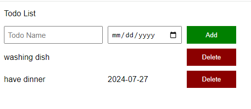

# MINI PROJECT 
*Đây là project được thiết kế bởi ngôn ngữ JavaScript, nhằm để ứng dụng kiến thức để xây dựng ***danh sách công việc***

---
# I. GIỚI THIỆU

---

## 1. Tác giả
**Họ và tên** : Hoàng ngọc
**Mã số sinh viên** : 23120146
**Lớp** : 23CTT2
**Trường** : Đại học Khoa Học Tự Nhiên

## 2. Cách cài đặt

Được xây dựng và thiết trên Visual Code. Để có thể trải nghiệm trò chơi thì hãy làm theo các bước sau

- Bước 1: Tải mã nguồn về máy
- Bước 2: Mở Visual Code và chọn mở foler mã nguồn
- Bước 2: Click chuột phải và chọn "Open in live sever" và trải nghiệm.

## 3. Hướng dẫn 
Bạn có thể lưu các thông tin những công việc cần làm cho ngày hôm nay
## 4. Các chức năng

- Lưu trữ ngày tháng năm và tên công việc lên màn hình.
- Giao diện thân thiện dễ sài.
- Có chức năng **Delete** để xoá các công việc đã làm xong.

## 5. Xây dựng bởi
- Công cụ: Visual Code.
- Ngôn ngữ: JavaScript, HTML, CSS.
- Hệ điều hành: Window 10.

---

# II. CHI TIẾT VỀ DỰ ÁN

---

## 1. Về mã nguồn

- File `README.md` để hướng dẫn người dùng sử dụng.
- File `todoList.html` chứa các Elements để hiển thị giao diện người dùng.
- File `styles.css` để thiết kế giao diện.
- File `script.js` để chứa các đoạn mã nguồn dùng để tương tác với người dùng. 

## 2. GIAO DIỆN

 
